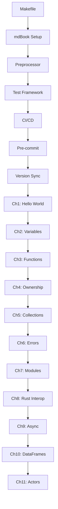

# Ruchy Book Development Roadmap

## Current Sprint: Book Infrastructure Setup
- **Duration**: 3 days (estimated)
- **Priority**: P0 - CRITICAL Foundation
- **Specification**: docs/ruchy-book-spec.md
- **Quality Gates**: All examples must compile with current ruchy version

## Task Tracking (BOOK-XXXX Format)

### Phase 1: Infrastructure & Tooling Setup 🚧

#### Core Infrastructure
| ID | Description | Status | Complexity | Priority |
|----|-------------|--------|------------|----------|
| BOOK-0001 | Create Makefile with quality gates | [x] | Low | P0 |
| BOOK-0002 | Set up mdBook project structure | [x] | Low | P0 |
| BOOK-0003 | Implement ruchy preprocessor for code validation | [ ] | High | P0 |
| BOOK-0004 | Create listing test framework | [x] | Medium | P0 |
| BOOK-0005 | Set up CI/CD pipeline with GitHub Actions | [x] | Medium | P0 |
| BOOK-0006 | Configure pre-commit hooks | [x] | Low | P0 |
| BOOK-0007 | Create version sync workflow | [ ] | Medium | P0 |
| BOOK-0008 | Upgrade to ruchy 0.4.14 for testing module | [ ] | Low | P0 |

### Phase 2: Level 0 Content (Immediate Productivity) 📋

#### Chapter 1: Hello World
| ID | Description | Status | Complexity | Priority |
|----|-------------|--------|------------|----------|
| BOOK-0100 | Write ch01-00-hello-world.md | [ ] | Low | P0 |
| BOOK-0101 | Create hello world listing with test | [ ] | Low | P0 |
| BOOK-0102 | Add transpilation insight section | [ ] | Low | P0 |

#### Chapter 2: Variables and Types
| ID | Description | Status | Complexity | Priority |
|----|-------------|--------|------------|----------|
| BOOK-0200 | Write ch02-00-variables-types.md | [ ] | Medium | P0 |
| BOOK-0201 | Create variable examples with tests | [ ] | Medium | P0 |
| BOOK-0202 | Document type inference behavior | [ ] | Medium | P0 |

#### Chapter 3: Functions and Control Flow
| ID | Description | Status | Complexity | Priority |
|----|-------------|--------|------------|----------|
| BOOK-0300 | Write ch03-00-functions.md | [ ] | Medium | P0 |
| BOOK-0301 | Write ch03-01-control-flow.md | [ ] | Medium | P0 |
| BOOK-0302 | Create function examples with tests | [ ] | Medium | P0 |
| BOOK-0303 | Create control flow examples with tests | [ ] | Medium | P0 |

### Phase 3: Level 1 Content (Real-World Programs) 📋

#### Chapter 4: Ownership Simplified
| ID | Description | Status | Complexity | Priority |
|----|-------------|--------|------------|----------|
| BOOK-0400 | Write ch04-00-ownership-simplified.md | [ ] | High | P1 |
| BOOK-0401 | Create ownership examples without Rust complexity | [ ] | High | P1 |
| BOOK-0402 | Document move vs copy semantics | [ ] | Medium | P1 |

#### Chapter 5: Collections
| ID | Description | Status | Complexity | Priority |
|----|-------------|--------|------------|----------|
| BOOK-0500 | Write ch05-00-collections.md | [ ] | Medium | P1 |
| BOOK-0501 | Create list/dict/set examples | [ ] | Medium | P1 |
| BOOK-0502 | Document collection method chains | [ ] | Medium | P1 |

#### Chapter 6: Error Handling
| ID | Description | Status | Complexity | Priority |
|----|-------------|--------|------------|----------|
| BOOK-0600 | Write ch06-00-error-handling.md | [ ] | High | P1 |
| BOOK-0601 | Create Result type examples | [ ] | High | P1 |
| BOOK-0602 | Document ? operator usage | [ ] | Medium | P1 |

#### Chapter 7: Modules
| ID | Description | Status | Complexity | Priority |
|----|-------------|--------|------------|----------|
| BOOK-0700 | Write ch07-00-modules.md | [ ] | Medium | P1 |
| BOOK-0701 | Create module organization examples | [ ] | Medium | P1 |
| BOOK-0702 | Document import/export patterns | [ ] | Medium | P1 |

### Phase 4: Level 2 Content (Systems Programming) 📋

#### Chapter 8: Rust Interop
| ID | Description | Status | Complexity | Priority |
|----|-------------|--------|------------|----------|
| BOOK-0800 | Write ch08-00-rust-interop.md | [ ] | High | P2 |
| BOOK-0801 | Create FFI examples | [ ] | High | P2 |
| BOOK-0802 | Document zero-cost abstractions | [ ] | High | P2 |

#### Chapter 9: Async/Await
| ID | Description | Status | Complexity | Priority |
|----|-------------|--------|------------|----------|
| BOOK-0900 | Write ch09-00-async-await.md | [ ] | High | P2 |
| BOOK-0901 | Create async runtime examples | [ ] | High | P2 |
| BOOK-0902 | Document task spawning patterns | [ ] | Medium | P2 |

#### Chapter 10: DataFrames
| ID | Description | Status | Complexity | Priority |
|----|-------------|--------|------------|----------|
| BOOK-1000 | Write ch10-00-dataframes.md | [ ] | High | P2 |
| BOOK-1001 | Create Polars integration examples | [ ] | High | P2 |
| BOOK-1002 | Document df! macro usage | [ ] | Medium | P2 |

#### Chapter 11: Actors
| ID | Description | Status | Complexity | Priority |
|----|-------------|--------|------------|----------|
| BOOK-1100 | Write ch11-00-actors.md | [ ] | High | P2 |
| BOOK-1101 | Create actor system examples | [ ] | High | P2 |
| BOOK-1102 | Document message passing patterns | [ ] | High | P2 |

### Phase 5: Level 3 Content (Advanced) 📋

#### Chapter 12: Macros
| ID | Description | Status | Complexity | Priority |
|----|-------------|--------|------------|----------|
| BOOK-1200 | Write ch12-00-macros.md | [ ] | High | P3 |
| BOOK-1201 | Create macro examples | [ ] | High | P3 |

#### Chapter 13: Unsafe
| ID | Description | Status | Complexity | Priority |
|----|-------------|--------|------------|----------|
| BOOK-1300 | Write ch13-00-unsafe.md | [ ] | High | P3 |
| BOOK-1301 | Create unsafe examples with safety contracts | [ ] | High | P3 |

#### Chapter 14: Refinement Types
| ID | Description | Status | Complexity | Priority |
|----|-------------|--------|------------|----------|
| BOOK-1400 | Write ch14-00-refinement-types.md | [ ] | High | P3 |
| BOOK-1401 | Create refinement type examples | [ ] | High | P3 |

#### Chapter 15: MCP Protocol
| ID | Description | Status | Complexity | Priority |
|----|-------------|--------|------------|----------|
| BOOK-1500 | Write ch15-00-mcp-protocol.md | [ ] | High | P3 |
| BOOK-1501 | Create MCP integration examples | [ ] | High | P3 |

## Execution DAG

## Quality Metrics

### Per-Chapter Requirements
- **Example Compilation Rate**: 100% (BLOCKING)
- **Test Coverage**: Every listing has output validation
- **Transpilation Docs**: Every feature shows generated Rust
- **Max Page Count**: As specified per level
- **Completion Time**: Must match target learning curve

### Infrastructure Requirements
- **CI Build Time**: <2 minutes
- **Version Sync Lag**: <24 hours from ruchy release
- **Link Validity**: 100% (no broken links)
- **Zero Vaporware**: No "coming soon" or unimplemented features

## Sprint Planning

### Current Sprint: Infrastructure Setup (Days 1-3)
**Goal**: Complete all Phase 1 infrastructure tasks

Day 1:
- BOOK-0001: Makefile with quality gates
- BOOK-0002: mdBook project structure
- BOOK-0006: Pre-commit hooks

Day 2:
- BOOK-0003: Ruchy preprocessor implementation
- BOOK-0004: Listing test framework

Day 3:
- BOOK-0005: CI/CD pipeline
- BOOK-0007: Version sync workflow

### Sprint 2: Level 0 Content (Days 4-6)
**Goal**: Chapters 1-3 complete with all examples working

### Sprint 3: Level 1 Content (Days 7-11)
**Goal**: Chapters 4-7 complete with real-world examples

### Sprint 4: Level 2 Content (Days 12-17)
**Goal**: Chapters 8-11 complete with systems examples

### Sprint 5: Level 3 Content (Days 18-21)
**Goal**: Chapters 12-15 complete for advanced users

## Risk Mitigation

### High Risk
- Ruchy compiler changes breaking examples → Version pinning + sync workflow
- Preprocessor complexity → Start simple, iterate

### Medium Risk
- Example compilation failures → Test every example in CI
- Documentation drift → Automated sync with compiler

### Low Risk
- Link rot → mdbook-linkcheck in CI
- Performance issues → Benchmark in CI

## Success Criteria

1. **Zero Broken Examples**: Every code block compiles
2. **Living Documentation**: Updates within 24h of compiler changes
3. **Progressive Learning**: 80% complete Level 0 in 2 hours
4. **Quality Gates**: All enforced via CI/CD
5. **No Vaporware**: Only documented features work

## Notes

- All tasks follow BOOK-XXXX numbering scheme
- Commits must reference task IDs
- Zero tolerance for SATD comments
- Every sprint ends with working, tested chapters
- Documentation is implementation-first, not promise-first