# Documentation Status Testing Specification

**Version**: 1.0.0  
**Date**: August 20, 2025  
**Status**: Draft → Implementation  
**Methodology**: PAIML Implementation-First Documentation

## 🎯 **Objective**

Ensure that **all documentation always reflects the true state of Ruchy implementation** by automatically marking examples as:
- ✅ **Working** - Compiles and runs correctly  
- ⚠️ **Not Implemented** - Valid syntax but feature not yet implemented
- ❌ **Broken** - Syntax or implementation issues
- 📋 **Planned** - Future features with clear roadmap

## 🏗️ **Architecture Overview**

### Core Principle: **Truth-Driven Documentation**

> *"Documentation that lies about what works is worse than no documentation at all. Every example must be tested, every claim must be verified, every feature status must be accurate."*

### Status Marking System

Documentation examples will be automatically annotated with real-time status indicators based on actual test results.

## 📋 **Status Classification System**

### ✅ **WORKING** - Fully Implemented
**Criteria**: Example compiles, runs, and produces expected output
```ruchy
// Status: ✅ WORKING (Ruchy v1.81.0+)  
// Last Verified: 2025-08-20
let x = 42
let y = x * 2
println(y)  // Output: 84
```

### ⚠️ **NOT IMPLEMENTED** - Planned Feature  
**Criteria**: Valid syntax, but runtime/compile-time indicates feature missing
```ruchy
// Status: ⚠️ NOT IMPLEMENTED (Planned: v1.81.0)
// Error: Method not found: .map()
// Last Tested: 2025-08-20
let numbers = [1, 2, 3]
let doubled = numbers.map(|x| x * 2)
```

### ❌ **BROKEN** - Implementation Issue
**Criteria**: Should work based on docs, but fails due to bugs
```ruchy
// Status: ❌ BROKEN (Issue #123)
// Error: Type inference failure in conditional
// Last Tested: 2025-08-20  
let result = if true { 42 } else { "hello" }
```

### 📋 **PLANNED** - Future Feature
**Criteria**: Documented future capability with clear implementation timeline
```ruchy
// Status: 📋 PLANNED (Roadmap: Q2 2025)
// Feature: Async/await syntax
// Tracking: Feature request #456
async fn fetch_data() -> Result<String> {
    http::get("https://api.example.com").await
}
```

## 🔧 **Implementation Strategy**

### 1. **Automated Status Detection**

#### Test Result Analysis Pipeline

```mermaid
graph TD
    A[Extract Code Examples] --> B[Run Against Ruchy Compiler]
    B --> C{Compilation Result}
    C -->|Success| D[Runtime Test]
    C -->|Error| E[Classify Error Type]
    D -->|Pass| F[Mark as WORKING ✅]
    D -->|Fail| G[Mark as BROKEN ❌]  
    E -->|Syntax Error| H[Mark as BROKEN ❌]
    E -->|Not Implemented| I[Mark as NOT IMPLEMENTED ⚠️]
    F --> J[Update Documentation]
    G --> J
    H --> J
    I --> J
```


#### Error Classification Rules
```yaml
classification_rules:
  working:
    - exit_code: 0
    - output_matches_expected: true
    
  not_implemented:
    - error_patterns:
      - "Method not found"
      - "Function not implemented"  
      - "Feature not available"
      - "Unresolved import"
      
  broken:
    - error_patterns:
      - "Type mismatch"
      - "Unexpected token"
      - "Parse error"
      - "Internal compiler error"
      
  planned:
    - documented_in_roadmap: true
    - implementation_timeline: exists
```

### 2. **Documentation Status Injection**

#### Status Header Format
```markdown
<!-- DOC_STATUS_START -->
**Example Status**: ✅ WORKING (Ruchy v1.81.0+)  
**Last Verified**: 2025-08-20 16:30:00 UTC  
**Success Rate**: 100% (1/1 examples working)
<!-- DOC_STATUS_END -->

```ruchy
// This example is automatically tested and verified
let message = "Hello, Ruchy!"
println(message)
```
```

#### Multi-Example Status Blocks
```markdown
<!-- DOC_STATUS_START -->
**Chapter Status**: ⚠️ PARTIAL (3/7 examples working)  
**Last Verified**: 2025-08-20 16:30:00 UTC  
**Next Implementation**: Array methods (v1.81.0)
<!-- DOC_STATUS_END -->

### Working Examples (3/7)
✅ Basic arithmetic and variables  
✅ String concatenation and manipulation  
✅ Control flow (if/else, loops)

### Not Yet Implemented (4/7)  
⚠️ Array operations (`.map()`, `.filter()`) - Planned v1.81.0  
⚠️ File I/O operations - Planned v1.81.0  
⚠️ HTTP client functionality - Planned v1.81.0  
⚠️ Database connections - Planned v1.81.0
```

### 3. **Continuous Documentation Validation**

#### GitHub Actions Workflow Integration
```yaml
# .github/workflows/docs-status-testing.yml
name: 📚 Documentation Status Testing

on:
  push:
    branches: [main, develop]
  pull_request:
    branches: [main]
  schedule:
    - cron: '0 */6 * * *'  # Every 6 hours
  workflow_dispatch:
    inputs:
      ruchy_version:
        description: 'Ruchy version to test against'
        required: false
        default: 'latest'

jobs:
  docs-status-update:
    runs-on: ubuntu-latest
    steps:
      - name: Update Documentation Status
        run: |
          # Extract all examples
          ./scripts/extract-and-test-all-simple.sh
          
          # Classify results and update docs
          python scripts/update-docs-status.py
          
          # Validate markdown quality
          ./scripts/lint-markdown.sh
          
          # Generate status report
          ./scripts/generate-status-report.sh
```

## 📝 **Markdown Linting Integration**

### Quality Standards Enforcement

#### Required Tools
```bash
# Install latest markdown linting tools
npm install -g markdownlint-cli2
npm install -g markdown-link-check  
npm install -g remark-cli remark-preset-lint-recommended
pip install mdformat mdformat-gfm mdformat-tables
```

#### Linting Configuration  
```json
// .markdownlint-cli2.json
{
  "config": {
    "MD013": {
      "line_length": 120,
      "code_blocks": false,
      "tables": false
    },
    "MD033": {
      "allowed_elements": ["details", "summary", "br"]
    },
    "MD041": false,
    "MD024": {
      "siblings_only": true  
    }
  },
  "globs": [
    "src/**/*.md",
    "docs/**/*.md", 
    "*.md"
  ],
  "ignores": [
    "node_modules/**",
    "target/**"
  ]
}
```

#### Custom Ruchy Documentation Rules
```yaml
# .remarkrc.yml  
plugins:
  - remark-preset-lint-recommended
  - remark-lint-no-dead-urls
  - remark-validate-links
  - ./scripts/remark-plugin-ruchy-examples.js

settings:
  bullet: '-'
  emphasis: '*'
  strong: '*'
  listItemIndent: 'one'
```

#### Ruchy-Specific Linting Rules
```javascript
// scripts/remark-plugin-ruchy-examples.js
export default function remarkRuchyExamples() {
  return (tree, file) => {
    visit(tree, 'code', (node) => {
      if (node.lang === 'ruchy') {
        // Ensure all Ruchy examples have status annotations
        if (!hasStatusAnnotation(node)) {
          file.message('Ruchy example missing status annotation', node);
        }
        
        // Validate syntax highlighting compatibility
        validateRuchySyntax(node, file);
      }
    });
  };
}
```

### Markdown Quality Checks
```bash
#!/bin/bash
# scripts/lint-markdown.sh

set -e

echo "🔍 Running comprehensive markdown quality checks..."

# 1. Basic markdown linting
echo "📝 Basic markdown linting..."
markdownlint-cli2 "src/**/*.md" "docs/**/*.md" "*.md"

# 2. Link validation  
echo "🔗 Link validation..."
find src docs -name "*.md" -exec markdown-link-check {} \;

# 3. Format consistency
echo "📐 Format consistency..."
mdformat --check src/ docs/ *.md

# 4. Table format validation
echo "📊 Table format validation..."
remark src/ docs/ --use remark-lint-table-pipes

# 5. Ruchy-specific validation
echo "🦀 Ruchy-specific validation..."
python scripts/validate-ruchy-examples.py

# 6. Status annotation validation
echo "✅ Status annotation validation..."  
python scripts/validate-status-annotations.py

echo "✅ All markdown quality checks passed!"
```

## 🤖 **Automated Status Update System**

### Status Update Script
```python
#!/usr/bin/env python3
# scripts/update-docs-status.py

import json
import re
import datetime
from pathlib import Path
from typing import Dict, List, Tuple

class DocsStatusUpdater:
    def __init__(self, test_results_path: str):
        self.test_results = self.load_test_results(test_results_path)
        self.ruchy_version = self.get_ruchy_version()
        self.timestamp = datetime.datetime.now(datetime.timezone.utc)
        
    def load_test_results(self, path: str) -> Dict:
        """Load test results from extraction script output."""
        with open(path) as f:
            return json.load(f)
    
    def classify_example_status(self, example_result: Dict) -> str:
        """Classify example status based on test results."""
        if example_result['passed']:
            return "✅ WORKING"
        
        error_msg = example_result.get('error', '').lower()
        
        # Not implemented patterns
        not_implemented_patterns = [
            'method not found',
            'function not implemented', 
            'feature not available',
            'unresolved import'
        ]
        
        if any(pattern in error_msg for pattern in not_implemented_patterns):
            return "⚠️ NOT IMPLEMENTED"
            
        # Broken patterns  
        broken_patterns = [
            'type mismatch',
            'unexpected token',
            'parse error',
            'internal compiler error'
        ]
        
        if any(pattern in error_msg for pattern in broken_patterns):
            return "❌ BROKEN"
            
        return "❌ BROKEN"  # Default for unknown failures
    
    def generate_status_header(self, chapter_results: Dict) -> str:
        """Generate status header for chapter."""
        total_examples = len(chapter_results['examples'])
        working_examples = sum(1 for ex in chapter_results['examples'] if ex['passed'])
        success_rate = (working_examples / total_examples * 100) if total_examples > 0 else 0
        
        if success_rate == 100:
            status_icon = "✅"
            status_text = "WORKING"
        elif success_rate >= 50:
            status_icon = "⚠️"  
            status_text = "PARTIAL"
        else:
            status_icon = "❌"
            status_text = "NEEDS IMPLEMENTATION"
            
        return f"""<!-- DOC_STATUS_START -->
**Chapter Status**: {status_icon} {status_text} ({working_examples}/{total_examples} examples working)  
**Last Verified**: {self.timestamp.strftime('%Y-%m-%d %H:%M:%S UTC')}  
**Ruchy Version**: {self.ruchy_version}  
**Success Rate**: {success_rate:.1f}%
<!-- DOC_STATUS_END -->"""

    def update_chapter_documentation(self, chapter_path: Path):
        """Update a chapter's documentation with current status."""
        chapter_name = chapter_path.stem
        chapter_results = self.test_results.get(chapter_name, {})
        
        if not chapter_results:
            return  # No test results for this chapter
            
        content = chapter_path.read_text()
        
        # Remove existing status blocks
        content = re.sub(
            r'<!-- DOC_STATUS_START -->.*?<!-- DOC_STATUS_END -->\n\n?',
            '',
            content,
            flags=re.DOTALL
        )
        
        # Add new status header after the main title
        title_match = re.search(r'^(# .+?\n)', content, re.MULTILINE)
        if title_match:
            title_end = title_match.end()
            new_status = self.generate_status_header(chapter_results)
            content = content[:title_end] + '\n' + new_status + '\n\n' + content[title_end:]
        
        # Update individual example annotations
        content = self.update_example_annotations(content, chapter_results['examples'])
        
        chapter_path.write_text(content)
        print(f"✅ Updated status for {chapter_name}")

    def update_example_annotations(self, content: str, examples: List[Dict]) -> str:
        """Update individual example status annotations."""
        for example in examples:
            status = self.classify_example_status(example)
            # Implementation would update specific examples in the content
            # This is a placeholder for the full implementation
        return content

    def run(self):
        """Run the full status update process."""
        src_dir = Path('src')
        for chapter_file in src_dir.glob('ch*.md'):
            self.update_chapter_documentation(chapter_file)
        
        print(f"✅ Documentation status update complete!")

if __name__ == '__main__':
    updater = DocsStatusUpdater('test/extracted-examples/summary.json')
    updater.run()
```

## 📊 **Quality Metrics & Reporting**

### Documentation Health Dashboard
```yaml
# Dashboard Metrics
documentation_health:
  overall_status:
    working_examples: 72
    total_examples: 317
    success_rate: 22.7%
    
  by_category:
    basic_language: 76%      # Variables, functions, control flow
    one_liners: 40%          # Command-line usage  
    data_processing: 15%     # Arrays, collections
    advanced_features: 5%    # Async, traits, macros
    
  quality_metrics:
    markdown_lint_score: 98%
    link_validation: 100%
    example_coverage: 100%
    status_annotation_coverage: 100%
    
  update_frequency:
    last_full_scan: "2025-08-20 16:30:00 UTC"
    next_scheduled: "2025-08-20 22:30:00 UTC" 
    update_interval: "6 hours"
```

### Status Report Generation
```bash
#!/bin/bash
# scripts/generate-status-report.sh

echo "# 📊 Ruchy Documentation Status Report"
echo "Generated: $(date -u '+%Y-%m-%d %H:%M:%S UTC')"
echo ""

# Overall statistics
echo "## 🎯 Overall Status"
python3 -c "
import json
with open('test/extracted-examples/summary.json') as f:
    data = json.load(f)
    
print(f\"📄 Chapters: {data['chapters_processed']}\")
print(f\"💻 Examples: {data['examples_found']}\") 
print(f\"✅ Working: {data['examples_working']} ({data['success_rate']}%)\")
print(f\"❌ Failing: {data['examples_failing']}\")
print(f\"🦀 Ruchy Version: {data['ruchy_version']}\")
"

echo ""
echo "## 📈 Trends"
echo "- ✅ Math functions implemented in v1.81.0+"
echo "- ⚠️ Array operations planned for v1.81.0" 
echo "- 📋 Async/await planned for v1.81.0"

echo ""
echo "## 🔧 Next Actions"
echo "1. Implement array `.map()` and `.filter()` methods"
echo "2. Add string manipulation methods (`.len()`, `.trim()`)"
echo "3. Basic file I/O operations"
```

## 🚀 **Implementation Roadmap**

### Phase 1: Foundation (Week 1-2)
- ✅ Basic status classification system
- ✅ Test result integration with docs
- ✅ Markdown linting setup
- ✅ GitHub Actions integration

### Phase 2: Automation (Week 3-4)  
- [ ] Automatic status header injection
- [ ] Individual example annotation
- [ ] Custom markdown linting rules
- [ ] Status dashboard generation

### Phase 3: Quality Enhancement (Week 5-6)
- [ ] Advanced error classification
- [ ] Performance tracking
- [ ] Visual status indicators
- [ ] Integration with Ruchy compiler CI

### Phase 4: Maintenance (Ongoing)
- [ ] Status accuracy monitoring  
- [ ] Documentation debt tracking
- [ ] Automated issue creation for regressions
- [ ] Community contribution guidelines

## 🎯 **Success Criteria**

### Immediate Goals
- [ ] 100% of examples have status annotations
- [ ] 0 markdown linting errors
- [ ] 100% link validation pass rate
- [ ] Automated status updates on every commit

### Long-term Goals  
- [ ] 80%+ working example rate
- [ ] <24 hour status update latency
- [ ] Zero false positive "working" examples
- [ ] Community trust in documentation accuracy

## 🔄 **Continuous Improvement**

### Feedback Loops
1. **Developer Feedback**: Track when docs don't match reality
2. **User Reports**: Documentation issues from community  
3. **Compiler Changes**: Automatic detection of new capabilities
4. **Performance Metrics**: Track documentation health over time

### Quality Assurance
- **Daily automated validation**
- **PR-based status verification** 
- **Community contribution validation**
- **Regression detection and alerts**

---

**Specification Status**: ✅ READY FOR IMPLEMENTATION  
**Next Step**: Begin Phase 1 implementation  
**Owner**: Documentation Team  
**Reviewers**: Ruchy Core Team